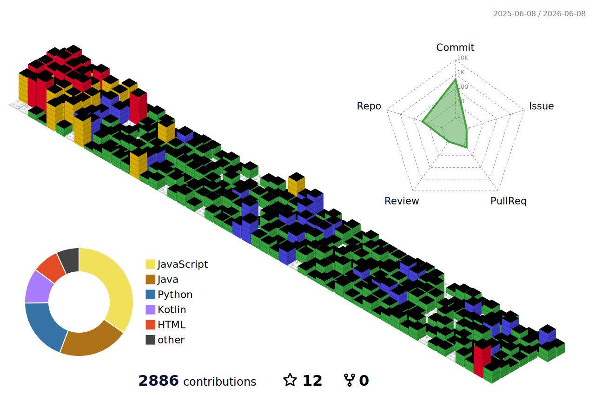

<h1 align="center">Aayush Raut</h1>

<p align="center">
  <strong>Systems Engineer | Feedback-Driven Design | Scalable Architecture</strong><br>
  <em>Building systems that become better through use</em>
</p>

<p align="center">
  
  
  
</p>

<picture>
  <source media="(prefers-color-scheme: dark)" srcset="https://raw.githubusercontent.com/AayuAmor/AayuAmor/output/github-contribution-grid-snake-dark.svg">
  <source media="(prefers-color-scheme: light)" srcset="https://raw.githubusercontent.com/AayuAmor/AayuAmor/output/github-contribution-grid-snake.svg">
  
</picture>

<p align="center">
  <strong>📊 My GitHub Universe in 3D</strong>
</p>

<picture>
  <source media="(prefers-color-scheme: dark)" srcset="profile-3d-contrib/profile-night-green.svg">
  <source media="(prefers-color-scheme: light)" srcset="profile-3d-contrib/profile-green-animate.svg">
  
</picture>

<blockquote align="center">
  🧱 Every commit is an experiment: define constraints, build abstractions, measure impact, iterate.
</blockquote>

---

<h2 align="center">🧠 How I Think About Systems</h2>

<details>
<summary>Engineering philosophy and decision framework</summary>

**Core Perspective**

I approach software as systems with explicit constraints, measurable inputs/outputs, and continuous feedback loops. Every layer—from API design to data transformation—must have observable behavior and clear ownership boundaries.

**System Decomposition**

- **Inputs:** User intent, context, constraints
- **Processing:** Transformations, orchestration, business logic
- **Outputs:** Observable behavior, measurable outcomes, reliable state
- **Feedback:** Observe latency, reliability, complexity — refactor when signals degrade

**Design Decisions**

- Build modular abstractions that hide accidental complexity
- Prefer async-first, queue-oriented thinking for resilience
- Optimize for long-term maintainability, not short-term convenience
- Use measurement as the foundation for optimization

**Decision Making**

- Frame problems as optimization surfaces, not feature lists
- Identify bottlenecks that meaningfully impact outcomes
- Design observable failure modes before building
- Ship incremental, measurable versions for iteration

</details>

---

<h2 align="center">🏗️ Engineering Competencies</h2>

**Systems Architecture**  
Designing modular systems with clear interfaces, ownership boundaries, and observable behavior patterns.

**Backend & Data**  
Building resilient data pipelines, async orchestration, schema design for evolving requirements, query optimization.

**Full-Stack Integration**  
Connecting frontend intent to backend logic through clean API boundaries and predictable data flow.

**Problem Decomposition**  
Breaking complex systems into smaller constraints, identifying bottlenecks, validating solutions through measurement.

**Code for Longevity**  
Writing systems that remain maintainable as requirements evolve — favoring clarity over cleverness.

---

<h2 align="center">� Core Capabilities</h2>

**Application Design** — Building systems with clear module boundaries, composable abstractions, and predictable interfaces

**Data Systems** — Schema architecture, query optimization, handling state evolution, designing for scale

**Async & Concurrency** — Queue-oriented orchestration, event-driven patterns, correctness under concurrent access

**Observability** — Designing systems that emit meaningful signals; using metrics and behavior to guide optimization

**Scalability** — Building systems that degrade gracefully, handle growth through architecture (not just performance tweaks)

---

<h2 align="center">⚙️ Engineering Principles</h2>

<div align="center">

**Build Systems, Not Features**  
Systems have inputs, transformations, outputs, and feedback. Features are merely expressions of system behavior.

**Optimize for Clarity**  
Complex code is not sophisticated code. Clarity through simple abstractions compounds over time.

**Measurement First**  
Cannot optimize what cannot be measured. Observable behavior guides architecture decisions.

**Long-Term Maintainability**  
Today's architectural decision impacts months of future maintenance. Optimize for the team reading code in a year.

**Feedback-Driven Iteration**  
Ship observable versions. Use real-world feedback to refine constraints, not ego to defend initial design.

**Small, Owned Modules**  
Single responsibility, clear interfaces, explicit ownership. Prevents complexity leakage and enables testing.

</div>

---

<h2 align="center">🔬 Research Direction</h2>

<div align="center">

**Systems that Adapt**  
Building systems that improve through feedback — learning from user behavior, adjusting to constraints, evolving with requirements.

**Scaling Without Complexity**  
How to grow systems while keeping them coherent. When does monolithic become distributed? When does simple become essential complexity versus accidental?

**Feedback Loops as Architecture**  
Designing for measurement: What signals matter? How do you build systems that emit truly useful observability without drowning in noise?

**Human-System Interaction**  
How abstractions affect people. Does the system interface clarify or obscure intent? Do error messages help or confuse?

</div>

---

<h2 align="center"> Building Methodology</h2>

<table>
<tr>
<td width="33%">

### 1. Understand

- Map system constraints
- Define success metrics
- Identify bottlenecks that matter
- Design failure modes

</td>
<td width="33%">

### 2. Build

- Create modular abstractions
- Make behavior observable
- Ship incrementally
- Measure everything

</td>
<td width="33%">

### 3. Refine

- Observe real-world signals
- Identify complexity leaks
- Refactor abstractions
- Iterate from feedback

</td>
</tr>
</table>

---

<h2 align="center">execution mode</h2>

<div align="center">

```
STATUS: BUILDING
FOCUS: SYSTEM DESIGN
APPROACH: ITERATIVE REFINEMENT
HORIZON: LONG-TERM PATTERNS
```

</div>

---

<div align="center">

**🔷 I optimize for system behavior over time, not code volume in the moment.**

</div>

---

<h2 align="center">📫 Let's Connect</h2>

<p align="center">
  <a href="mailto:aayuamor@gmail.com">
    
  </a>
  <a href="https://linkedin.com/in/aayush-raut-0009662b6/">
    
  </a>
  <a href="https://twitter.com/AayuAmor">
    
  </a>
  <a href="https://instagram.com/a4yush.dev">
    
  </a>
  <a href="https://aayuamor.github.io/My-Portfolio/">
    
  </a>
</p>

---

<p align="center">
  <a href="https://aayushkraut.com.np/">
    
  </a>
</p>
