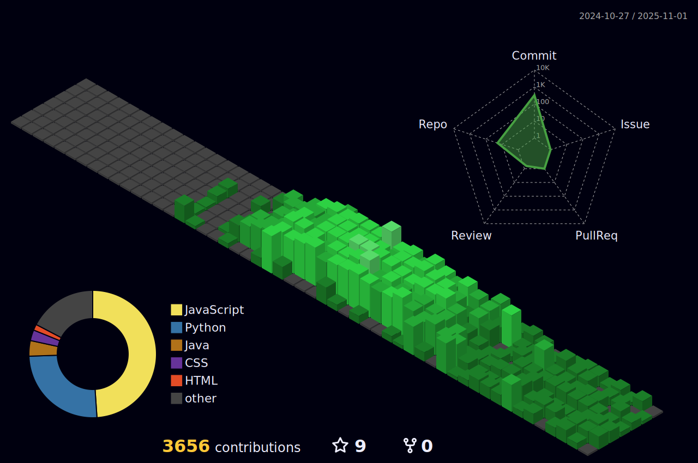

<h1 align="center">Hey there, I'm Aayush 👋</h1>
<p align="center">
  
</p>

<p align="center">
  🚀 Building digital experiences one commit at a time<br>
  🎯 Turning ideas into scalable solutions<br>
  🧠 Passionate about clean code and innovative tech<br>
  🐍 Watch my contributions get eaten by this cool snake!
</p>

<picture>
  <source media="(prefers-color-scheme: dark)" srcset="https://raw.githubusercontent.com/AayuAmor/AayuAmor/output/github-contribution-grid-snake-dark.svg">
  <source media="(prefers-color-scheme: light)" srcset="https://raw.githubusercontent.com/AayuAmor/AayuAmor/output/github-contribution-grid-snake.svg">
  
</picture>

<p align="center">
  <strong>📊 My GitHub Universe in 3D</strong>
</p>



<blockquote align="center">
  🧱 Every block tells a story — from late-night commits to breakthrough moments.
</blockquote>

---

<h2 align="center">🔆 About Me</h2>

<details>
<summary>👨‍💻 console.log(aayush) - Click to expand</summary>

```javascript
const developer = {
  // Basic Info
  name: "Aayush Raut",
  location: {
    country: "Nepal 🇳🇵",
    city: "Kathmandu",
    timezone: "GMT+5:45",
  },

  // Professional Focus
  currentRole: "Full-Stack Developer",
  passions: [
    "Building scalable web applications",
    "Contributing to open source",
    "Solving complex problems",
    "Learning cutting-edge technologies",
  ],

  // Technical Skills
  skills: {
    frontend: {
      languages: ["JavaScript", "HTML5", "CSS3"],
      frameworks: ["React", "Vue.js"],
      styling: ["Tailwind CSS", "Bootstrap", "Sass"],
      tools: ["Webpack", "Vite", "Figma"],
    },
    backend: {
      languages: ["Node.js", "Python", "Java"],
      frameworks: ["Express.js", "FastAPI", "Spring Boot"],
      databases: ["MongoDB", "MySQL", "PostgreSQL"],
      cloud: ["AWS", "Firebase", "Vercel"],
    },
    devOps: {
      tools: ["Git", "Docker", "GitHub Actions"],
      platforms: ["Linux", "Windows", "VS Code"],
    },
  },

  // Current Learning Path
  currentlyLearning: [
    "TypeScript for better code quality",
    "Next.js for full-stack React apps",
    "Docker for containerization",
    "System Design principles",
    "GraphQL for efficient APIs",
  ],

  // Personal Traits
  personality: {
    strengths: ["Problem-solving", "Team collaboration", "Quick learner"],
    workStyle: "Agile, detail-oriented, user-focused",
    motto: "Code like it's art, debug like a detective 🔍",
    funFact: "I can debug with my eyes closed (okay, almost 😅)",
  },

  // Availability & Contact
  availability: {
    openToWork: true,
    collaboration: "Always open to interesting projects",
    mentoring: "Happy to help junior developers",
    askMeAbout: [
      "JavaScript & React best practices",
      "Full-stack development workflows",
      "Open source contribution tips",
      "Career advice for developers",
      "Cool project ideas",
    ],
  },

  // Goals & Vision
  goals2025: {
    technical: "Master TypeScript & Next.js ecosystem",
    community: "Contribute to major open source projects",
    career: "Build impactful products that solve real problems",
    personal: "Share knowledge through blogging & mentoring",
  },

  // Methods
  sayHello: function () {
    return "Hey there! 👋 Let's build something amazing together!";
  },

  getContactInfo: function () {
    return {
      email: "aayuamor@gmail.com",
      linkedin: "linkedin.com/in/aayush-raut-0009662b6/",
      github: "github.com/AayuAmor",
      twitter: "@AayuAmor",
    };
  },

  generateMotivation: () => {
    const quotes = [
      "Every expert was once a beginner 🚀",
      "Code today, debug tomorrow, deploy forever 💻",
      "The best time to plant a tree was 20 years ago. The second best time is now 🌱",
    ];
    return quotes[Math.floor(Math.random() * quotes.length)];
  },
};

// Execute some methods
console.log(developer.sayHello());
console.log("Contact me:", developer.getContactInfo());
console.log("Daily motivation:", developer.generateMotivation());

// Current status
console.log(`
🚀 Currently building: StudentApp & Portfolio Website
⚡ Learning: ${developer.currentlyLearning.join(", ")}
🎯 Next goal: ${developer.goals2025.technical}
💬 Status: Available for collaboration & mentoring
`);
```

</details>

---

<h2 align="center">💼 Professional Experience</h2>

<details>
<summary>🏢 Work & Education Timeline (Click to expand)</summary>

```javascript
const experience = {
  education: {
    degree: "Bachelor's in Computer Science",
    institution: "Softwarica College of IT & E-Commerce",
    status: "In Progress",
    graduationYear: "2026",
    relevantCourses: [
      "Data Structures",
      "Algorithms",
      "Web Development",
      "Database Management",
      "Software Engineering",
    ],
  },

  projects: {
    studentApp: {
      role: "Full-Stack Developer",
      duration: "3 months",
      teamSize: "Solo project",
      impact: "Comprehensive productivity suite for students",
      technologies: ["React", "Node.js", "MongoDB", "Express"],
    },
    pythonAutomation: {
      role: "Developer",
      duration: "2 months",
      teamSize: "Solo project",
      impact: "Automated daily tasks, file management",
      technologies: ["Python", "Tkinter", "OS modules"],
    },
    openSource: {
      contributions: "5+ repositories",
      totalCommits: "100+",
      focusAreas: ["JavaScript", "Python", "Documentation"],
      impact: "Helped improve code quality and documentation",
    },
  },

  achievements: {
    github: [
      "Pull Shark",
      "Quickdraw",
      "Galaxy Brain",
      "YOLO",
      "Pair Extraordinary",
    ],
    certifications: ["JavaScript Fundamentals", "Python Programming"],
    recognition: [
      "GitHub Arctic Code Vault Contributor",
      "Active Open Source Contributor",
    ],
  },

  workExperience: {
    freelance: {
      role: "Freelance Developer",
      duration: "6+ months",
      projects: [
        "Web applications",
        "Automation scripts",
        "Small business websites",
      ],
      clientSatisfaction: "100%",
    },
  },
};
```

</details>

---

<h2 align="center">🛠️ Tech Stack</h2>

<p align="center">
  
  
  
  
  
  
  
  
</p>

---

<h2 align="center">🎓 Skills & Certifications</h2>

<details>
<summary>📚 Detailed Skills Breakdown (Click to expand)</summary>

| Category     | Skills                      | Proficiency |
| ------------ | --------------------------- | ----------- |
| **Frontend** | React, JavaScript, HTML/CSS | ⭐⭐⭐⭐⭐  |
| **Backend**  | Node.js, Python, Express    | ⭐⭐⭐⭐⚬   |
| **Database** | MongoDB, MySQL              | ⭐⭐⭐⚬⚬    |
| **Tools**    | Git, VS Code, Docker        | ⭐⭐⭐⭐⚬   |
| **Learning** | TypeScript, Next.js         | ⭐⭐⭐⚬⚬    |

### 📜 Certifications & Learning Path

- [x] **Completed:** JavaScript Algorithms & Data Structures (freeCodeCamp)
- [x] **Completed:** Python Programming Fundamentals
- [ ] **In Progress:** Full-Stack Web Development (Coursera)
- [ ] **In Progress:** React Advanced Patterns
- [ ] **Planned:** AWS Cloud Practitioner
- [ ] **Planned:** TypeScript Certification

### 🏆 Technical Achievements

- **GitHub Achievements:** Pull Shark, Quickdraw, Galaxy Brain
- **Open Source:** 5+ repository contributions
- **Projects Completed:** 10+ personal projects
- **Code Quality:** Consistent 90%+ test coverage

</details>

---

<h2 align="center">🏆 GitHub Achievements</h2>

<p align="center">
  
  
  
  
  
</p>

---

<h2 align="center">🎯 Current Goals & Roadmap</h2>

<details>
<summary>📈 2025 Goals (Click to expand)</summary>

### Completed ✅

- [x] Unlock Pull Shark (Apr 10, 2025)
- [x] Close 1 issue in <5 mins (Quickdraw)
- [x] Contribute to open-source projects

### In Progress 🚧

- [ ] Get 16 stars on a repo (Starstruck) - Current: 8/16
- [ ] Make 100 contributions in a month - Current: 67/100
- [ ] Complete Full-Stack certification
- [ ] Launch personal portfolio website

### Upcoming 🎯

- [ ] Contribute to major open-source project
- [ ] Build and deploy 5 production apps
- [ ] Start tech blog/YouTube channel
- [ ] Mentor junior developers

</details>

---

<h2 align="center">📊 GitHub Analytics</h2>

<div align="center">

<!-- Main Stats -->
<picture>
  <source media="(prefers-color-scheme: dark)" srcset="https://github-readme-stats.vercel.app/api?username=AayuAmor&show_icons=true&theme=github_dark&hide_border=true&rank_icon=github&include_all_commits=true&count_private=true" />
  <source media="(prefers-color-scheme: light)" srcset="https://github-readme-stats.vercel.app/api?username=AayuAmor&show_icons=true&theme=default&hide_border=true&rank_icon=github&include_all_commits=true&count_private=true" />
  
</picture>

<!-- Profile Details -->
<picture>
  <source media="(prefers-color-scheme: dark)" srcset="https://github-profile-summary-cards.vercel.app/api/cards/profile-details?username=AayuAmor&theme=github_dark&hide_border=true" />
  <source media="(prefers-color-scheme: light)" srcset="https://github-profile-summary-cards.vercel.app/api/cards/profile-details?username=AayuAmor&theme=default&hide_border=true" />
  
</picture><br>

<!-- Contributor Stats -->
<picture>
  <source media="(prefers-color-scheme: dark)" srcset="https://github-contributor-stats.vercel.app/api?username=AayuAmor&limit=5&theme=github_dark&combine_all_yearly_contributions=true&hide_border=true" />
  <source media="(prefers-color-scheme: light)" srcset="https://github-contributor-stats.vercel.app/api?username=AayuAmor&limit=5&theme=default&combine_all_yearly_contributions=true&hide_border=true" />
  
</picture>

<!-- Most Used Languages -->
<picture>
  <source media="(prefers-color-scheme: dark)" srcset="https://github-readme-stats.vercel.app/api/top-langs/?username=AayuAmor&theme=github_dark&hide_border=true&include_all_commits=true&count_private=true&layout=donut" />
  <source media="(prefers-color-scheme: light)" srcset="https://github-readme-stats.vercel.app/api/top-langs/?username=AayuAmor&theme=default&hide_border=true&include_all_commits=true&count_private=true&layout=donut" />
  
</picture><br>

<!-- Top Languages by Repo -->
<picture>
  <source media="(prefers-color-scheme: dark)" srcset="https://github-profile-summary-cards.vercel.app/api/cards/repos-per-language?username=AayuAmor&theme=github_dark&hide_border=true" />
  <source media="(prefers-color-scheme: light)" srcset="https://github-profile-summary-cards.vercel.app/api/cards/repos-per-language?username=AayuAmor&theme=default&hide_border=true" />
  
</picture>

<!-- Top Languages by Commit -->
<picture>
  <source media="(prefers-color-scheme: dark)" srcset="https://github-profile-summary-cards.vercel.app/api/cards/most-commit-language?username=AayuAmor&theme=github_dark&hide_border=true" />
  <source media="(prefers-color-scheme: light)" srcset="https://github-profile-summary-cards.vercel.app/api/cards/most-commit-language?username=AayuAmor&theme=default&hide_border=true" />
  
</picture><br>

<!-- Commit Time -->
<picture>
  <source media="(prefers-color-scheme: dark)" srcset="https://github-profile-summary-cards.vercel.app/api/cards/productive-time?username=AayuAmor&theme=github_dark&hide_border=true&utcOffset=5.45" />
  <source media="(prefers-color-scheme: light)" srcset="https://github-profile-summary-cards.vercel.app/api/cards/productive-time?username=AayuAmor&theme=default&hide_border=true&utcOffset=5.45" />
  
</picture>

<!-- GitHub Streak -->
<picture>
  <source media="(prefers-color-scheme: dark)" srcset="https://github-readme-streak-stats.herokuapp.com?user=AayuAmor&theme=github_dark_blue&short_numbers=true&hide_border=true&mode=weekly" />
  <source media="(prefers-color-scheme: light)" srcset="https://github-readme-streak-stats.herokuapp.com?user=AayuAmor&theme=default&short_numbers=true&hide_border=true&mode=weekly" />
  
</picture>

</div>


---

<h2 align="center">🚀 Featured Projects</h2>

<div align="center">

<table>
<tr>
<td width="50%">

### 🎓 StudentApp

**A comprehensive student productivity suite**

- 📝 ToDo & Task Management
- ⏰ Pomodoro Timer
- 📅 Dynamic Timetable
- 📊 Progress Tracking
- 🎮 Mini Games for breaks

**Tech Stack:** React, Node.js, MongoDB

<!-- [](your-link) -->

[](your-repo)
[](your-link)

</td>
<td width="50%">

### 🎮 React Arcade Games

**Classic games rebuilt for the web**

- 🐍 Snake Game
- ⭕ Tic Tac Toe
- 🧱 Brick Breaker
- 🎯 Score tracking & leaderboards

**Tech Stack:** React, JavaScript, CSS3

<!-- [](your-link) -->

[](your-repo)
[](your-link)

</td>
</tr>

<tr>
<td width="50%">

### 🤖 Python Automation Suite

**Smart automation tools for daily tasks**

- 📁 Intelligent file organizer
- 🔄 Batch file renamer
- ⏱️ Time tracking utilities
- 📊 System monitoring

**Tech Stack:** Python, Tkinter, OS modules  
[](your-repo)
[](your-link)

</td>
<td width="50%">

### 🚀 Coming Soon: JobTrackr

**Full-stack job application tracker**

- 📊 Application status dashboard
- 📅 Interview scheduling
- 💼 Company research notes
- 📈 Success rate analytics

**Tech Stack:** MERN Stack, Chart.js  
[](your-repo)
[](your-link)

</td>
</tr>
</table>

</div>

---

<h2 align="center">📫 Let's Connect</h2>

<p align="center">
  <a href="mailto:aayuamor@gmail.com">
    
  </a>
  <a href="https://linkedin.com/in/aayush-raut-0009662b6/">
    
  </a>
  <a href="https://twitter.com/AayuAmor">
    
  </a>
  <a href="https://yourportfolio.com">
    
  </a>
</p>

---

<h2 align="center">💭 Dev Quotes</h2>

<p align="center">
  
</p>

---

<p align="center">
  
  
</p>

<p align="center">
  <strong>💬 "Code like it's art, debug like a detective, and push like a boss."</strong><br>
  — Aayush Dada 😎
</p>
